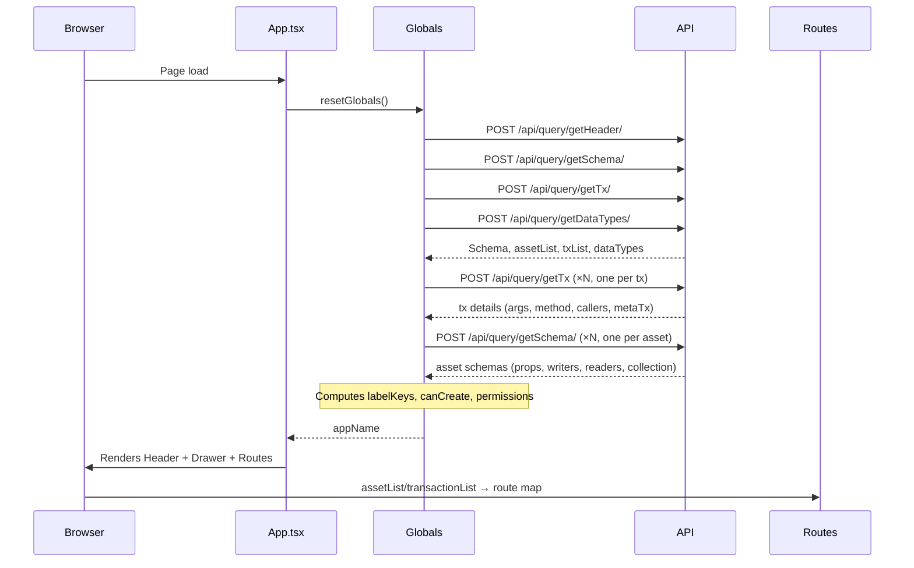
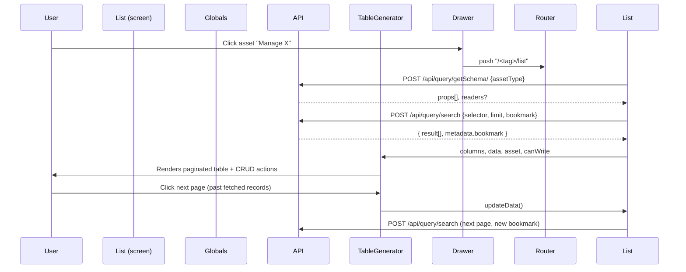
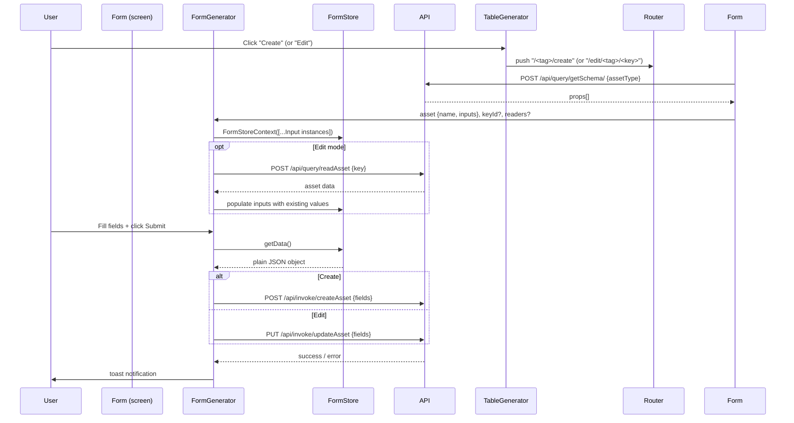

# GoInitus — Reverse-Engineering & Modernization Documentation

> **Single source of truth** for understanding, modernizing, or rebuilding the GoInitus project from scratch.
> Generated by reverse-engineering the existing codebase on 2026-03-24.

---

## Table of Contents

1. [Executive Summary](#1-executive-summary)
2. [Project Structure Map](#2-project-structure-map)
3. [Tech Stack Inventory & Health Report](#3-tech-stack-inventory--health-report)
4. [API & Chaincode Integration Reference](#4-api--chaincode-integration-reference)
5. [Component & Module Catalog](#5-component--module-catalog)
6. [Data Flow & State Management](#6-data-flow--state-management)
7. [Key User Flows](#7-key-user-flows)
8. [Technical Debt & Issues Log](#8-technical-debt--issues-log)
9. [Modernization Recommendations](#9-modernization-recommendations)
10. [Suggested New Project Architecture](#10-suggested-new-project-architecture)

---

## 1. Executive Summary

**GoInitus** (also referred to as "GoFabric WebClient") is a React + TypeScript single-page application (SPA) that provides a generic web-based explorer and transaction interface for any [GoFabric](https://github.com/GoLedgerDev/cc-tools) Hyperledger Fabric chaincode backend.

### What it does

| Capability | Description |
|---|---|
| **Schema-driven UI** | On startup, queries the GoFabric REST API for the chaincode's asset schemas and transaction definitions, then builds all forms and tables dynamically at runtime. No hardcoded asset types. |
| **Asset CRUD** | Create, read, update and delete any asset type defined in the chaincode, with field-level permission checks driven by org MSP. |
| **Transaction invocation** | Lists every non-meta chaincode transaction, renders a generated form for its arguments, and submits via `POST /api/invoke/<txName>` or `PUT`. |
| **Query execution** | Submits chaincode queries via `GET /api/query/<txName>`. |
| **Asset history** | Fetches the full ledger history of any asset using `readAssetHistory`. |
| **Asset inspection** | Reads a single asset by `@key` with full field resolution including nested assets. |
| **Dynamic asset types** | Optionally allows privileged orgs to create/delete chaincode asset types at runtime via `createAssetType` / `deleteAssetType`. |
| **cURL export** | Every query or invoke operation can be previewed and copied as a ready-to-run `curl` command. |
| **Server configuration** | Node address, Basic-Auth credentials and HTTPS access are configurable in-browser at runtime. |
| **Private data collections** | Reads assets that reside in Fabric private data collections. |

### Deployment target
Static React SPA, served by an Nginx container. The GoFabric REST Server (cc-web, Go) runs separately and is addressed via `REACT_APP_BASE_URL` at build time or via a browser-cookie injected by Nginx at runtime.

---

## 2. Project Structure Map

```
go-initus/
├── .env                        # Dev environment variable: REACT_APP_BASE_URL
├── .eslintrc.json              # ESLint config (airbnb + prettier)
├── .eslintignore
├── .gitignore
├── Dockerfile                  # Multi-stage: Node build → Nginx serve
├── nginx.conf                  # Nginx server config (SPA fallback + cookie inject)
├── buildAndDeployImage.sh      # Helper script to build & push Docker image
├── package.json                # npm manifest + browserslist
├── prettier.config.js          # Prettier formatting rules
├── tsconfig.json               # TypeScript 3.7 compiler config
├── public/                     # CRA public assets
└── src/
    ├── index.tsx               # React DOM render entry point, MobX config
    ├── index.css               # Global reset styles
    ├── react-app-env.d.ts      # CRA type shim
    ├── App.tsx                 # Root component: bootstraps globals, auth gate, server config panel
    ├── Routes.tsx              # Dynamic BrowserRouter; generates routes from schema
    │
    ├── assets/
    │   └── goledger.svg        # GoLedger logo used in Header
    │
    ├── services/
    │   ├── api.ts              # Axios instance with base URL resolution + auth token + 401 handler
    │   └── gtelt_transformer.ts # CouchDB range query helper ($gte / $lt)
    │
    ├── store/                  # MobX observable state
    │   ├── Globals.tsx         # Central singleton: schema, asset list, tx list, auth, permissions
    │   ├── FormStore.tsx       # Per-form singleton: holds Input instances, getData(), clearInputs()
    │   ├── DashboardStore.tsx  # Dashboard panel config (mostly hardcoded placeholders)
    │   └── inputs/             # MobX input model classes (one per field data type)
    │       ├── types.d.ts      # InputType, NumberInputType, PropListType, ISelectValueType
    │       ├── TextInput.ts
    │       ├── NumberInput.ts
    │       ├── BooleanInput.ts
    │       ├── DateInput.ts
    │       ├── AssetInput.ts
    │       ├── AssetListInput.ts
    │       ├── TextListInput.ts
    │       ├── NumberListInput.ts
    │       ├── DateListInput.ts
    │       ├── AnyAssetInput.ts
    │       ├── PropListInput.ts
    │       ├── OAuthCredentialInput.ts
    │       └── XYTCredentialInput.ts
    │
    ├── types/                  # Pure TypeScript type definitions (no runtime code)
    │   ├── Asset.ts
    │   ├── AssetList.ts
    │   ├── Caller.ts
    │   ├── DataTypeList.ts
    │   ├── FieldView.ts
    │   ├── Inputs.ts
    │   ├── Schema.ts
    │   ├── Transaction.tsx
    │   └── TransactionList.ts
    │
    ├── components/             # Reusable presentational/controlled components
    │   ├── Chart/index.tsx     # Recharts line chart (dashboard panel)
    │   ├── CurlPanel/index.tsx # Modal that shows + copies curl command for any request
    │   ├── Drawer/
    │   │   ├── index.tsx       # MUI Drawer shell; composes DrawerList + TransItemList
    │   │   ├── DrawerList.tsx  # Single nav item for an asset type
    │   │   ├── TransItemList.tsx # Single nav item for a transaction
    │   │   └── styles.ts
    │   ├── FixedPanel/index.tsx # Dashboard fixed value panel
    │   ├── Forms/              # Controlled MUI input components (one per input model class)
    │   │   ├── CTextInput.tsx
    │   │   ├── CNumberInput.tsx
    │   │   ├── CBooleanInput.tsx
    │   │   ├── CDateInput.tsx
    │   │   ├── CAssetInput.tsx
    │   │   ├── CAssetListInput.tsx
    │   │   ├── CTextListInput.tsx
    │   │   ├── CNumberListInput.tsx
    │   │   ├── CDateListInput.tsx
    │   │   ├── CDropDownInput.tsx
    │   │   ├── CDropDownListInput.tsx
    │   │   ├── CAnyAssetInput.tsx
    │   │   ├── CPropListInput.tsx
    │   │   ├── COAuthCredentialInput.tsx
    │   │   ├── CXYTCredentialInput.tsx
    │   │   └── styles.ts
    │   ├── Header/
    │   │   ├── index.tsx       # Top app bar: menu toggle, back, reload, settings, org name, logo
    │   │   └── styles.ts
    │   └── PiePanel/index.tsx  # Dashboard pie chart panel
    │
    ├── generators/             # "Smart" components that assemble entire UIs from schema data
    │   ├── FormGenerator/
    │   │   ├── index.tsx       # Asset create/edit form: fetches item, renders inputs, submits
    │   │   ├── styles.tsx
    │   │   └── utils.tsx       # fromJsonToFormContext(), getForm() – input type factory
    │   ├── TableGenerator/
    │   │   ├── index.tsx       # Asset list table via material-table with CRUD row actions
    │   │   └── styles.ts
    │   ├── TxFormGenerator/
    │   │   ├── index.tsx       # Transaction form: renders inputs, submits invoke/query
    │   │   ├── styles.tsx
    │   │   └── utils.tsx       # fromJsonToFormContext() variant for tx args
    │   └── UpdateTypeFormGenerator/
    │       ├── index.tsx       # Form for editing a dynamic asset type's schema
    │       ├── styles.tsx
    │       └── utils.tsx
    │
    ├── screens/                # Route-level page components
    │   ├── Main/index.tsx      # Home: shows app name + version
    │   ├── Dashboard/
    │   │   ├── index.tsx       # Dashboard: renders panel grid
    │   │   └── Panel/index.tsx # Individual dashboard panel switcher
    │   ├── Form/index.tsx      # Asset create/edit page: fetches schema, mounts FormGenerator
    │   ├── UpdateTypeForm/     # Dynamic asset type edit page
    │   ├── List/
    │   │   ├── index.tsx       # Asset list page: fetches + paginates data, mounts TableGenerator
    │   │   ├── DateTimeModal/  # Modal to show full datetime value
    │   │   ├── ListTypeModal/  # Modal to show []string / []asset list values
    │   │   ├── ObjectModal/    # Modal to show @object field as JSON
    │   │   └── TokenModal/     # Modal to show full OpenID token string
    │   ├── Item/
    │   │   ├── index.tsx       # Asset detail page: reads single asset, shows all fields
    │   │   ├── SingleField/    # One label+value row in the detail view
    │   │   └── QrCodeDialog/   # QR code dialog for the asset's @key
    │   ├── TxForm/index.tsx    # Standard transaction page: mounts TxFormGenerator
    │   └── DynamicTxForm/index.tsx # createAssetType / deleteAssetType pages
    │
    ├── serviceWorker.ts        # CRA default service-worker (not customised)
    └── utils/
        ├── colorUtils.ts       # randomColor() – generates a dark hex colour for org theming
        └── dateUtils.ts        # getISODateTimeString(), setNewDate() – date formatting helpers
```

---

## 3. Tech Stack Inventory & Health Report

### Runtime dependencies

| Package | Current Version | Latest (approx.) | Status |
|---|---|---|---|
| `react` | 16.13.1 | **19.x** | ⚠️ 3 major versions behind; React 16 is EOL |
| `react-dom` | 16.13.1 | **19.x** | ⚠️ Same as react |
| `react-router` / `react-router-dom` | 5.2.0 | **6.x** | ⚠️ v5 is in maintenance mode; v6 has breaking API changes |
| `react-scripts` | 3.2.0 | **5.x** (CRA) or **Vite** | 🔴 Very outdated; CRA itself is deprecated/unmaintained |
| `typescript` | 3.7.2 | **5.x** | ⚠️ 2 major versions behind |
| `mobx` | 5.15.7 | **6.x** | ⚠️ v5 uses legacy decorators; v6 changed decorator API |
| `mobx-react` / `mobx-react-lite` | 6.2.2 / 2.2.2 | **9.x** | ⚠️ Behind; should match MobX 6 |
| `@material-ui/core` | 4.11.0 | **MUI 6.x** (renamed) | 🔴 MUI v4 is EOL; v5 is a full rewrite with `@mui/material` |
| `@material-ui/icons` | 4.11.2 | **MUI 6.x** | 🔴 Same as above |
| `@material-ui/pickers` | 3.2.10 | **`@mui/x-date-pickers`** | 🔴 Replaced by MUI X |
| `material-table` | 1.69.1 | **`@material-table/core` 3.x** | ⚠️ Original package unmaintained; fork exists |
| `axios` | 0.21.4 | **1.x** | ⚠️ 0.x is outdated; 1.x has breaking changes in error handling |
| `styled-components` | 4.4.1 | **6.x** | ⚠️ 2 major versions behind |
| `react-toastify` | 5.5.0 | **10.x** | ⚠️ Many versions behind |
| `react-select` | 3.1.0 | **5.x** | ⚠️ Behind |
| `recharts` | 1.8.5 | **2.x** | ⚠️ Major version behind |
| `qrcode.react` | 1.0.0 | **3.x** | ⚠️ Behind |
| `moment` | 2.29.4 | Legacy | 🔴 Moment.js is in maintenance-only mode; team recommends `date-fns` or `dayjs` |
| `@date-io/moment` | 1.3.13 | — | 🔴 Only needed by `@material-ui/pickers` which is also deprecated |
| `js-cookie` | 2.2.1 | **3.x** | ⚠️ Minor; v3 has TS-first API |
| `jwt-decode` | 2.2.0 | **4.x** | ⚠️ Behind |
| `react-google-login` | 5.1.21 | **Archived** | 🔴 Unmaintained; Google has deprecated the underlying API. Use `@react-oauth/google` |
| `polished` | 4.0.2 | 4.x | ✅ Current |
| `date-fns` | 2.16.1 | **3.x** | ⚠️ Minor; v3 has minor breaking changes |
| `uuid` | 3.4.0 | **11.x** | ⚠️ Behind |
| `query-string` | 6.13.1 | **9.x** | ⚠️ Behind |
| `react-copy-to-clipboard` | 5.0.3 | 5.x | ✅ Stable |

### Dev dependencies

| Package | Current Version | Status |
|---|---|---|
| `eslint` | 6.x | ⚠️ ESLint 9 has flat config format |
| `@typescript-eslint/*` | 2.x | ⚠️ Very outdated; v8 is current |
| `eslint-config-airbnb` | 18.x | ⚠️ Tied to old ESLint; airbnb config is in flux |
| `prettier` | 2.x | ⚠️ v3 is current |

### Build system

| Tool | Version | Status |
|---|---|---|
| `create-react-app` (via `react-scripts`) | 3.2.0 | 🔴 **CRA is officially deprecated** by Meta; Webpack 4 underneath |
| Node.js (Dockerfile base) | `erbium` (Node 12) | 🔴 Node 12 is EOL; use Node 20 LTS or 22 LTS |
| nginx | `alpine` | ✅ Current |

### Security vulnerabilities (known)
- `react-google-login` uses the deprecated Google Sign-In JS library, which was shut down March 2023.
- `axios` 0.21.4 has known CVEs (SSRF, prototype pollution in older patch); upgrade to 1.x.
- `react-scripts` 3.2.0 has many transitive dependency vulnerabilities (webpack, babel, etc.).
- `moment` is not vulnerable but is maintenance-only and very large (~300 KB gzipped).
- `node:erbium` Docker base image (Node 12) reached EOL in April 2022 — **do not use in production**.

---

## 4. API & Chaincode Integration Reference

### Connection setup (`src/services/api.ts`)

The Axios instance base URL is resolved at **module load time** in this priority order:

1. `localStorage.getItem('@Goinitus:restServer')` — user-configured address (persisted across sessions)
2. `process.env.REACT_APP_BASE_URL` — build-time env var (development mode)
3. `http://${Cookies.get('base_url')}:80` — cookie injected by Nginx from `$REACT_APP_BASE_URL` env var (production mode)

**Authentication:** HTTP Basic Auth via `Authorization` header. Token is stored as `Basic <base64(user:pass)>` in `localStorage` under the key `@Goinitus:authToken`. A `401` response interceptor sets the token to the sentinel value `askForToken`, which triggers the credentials UI in `App.tsx`.

> ⚠️ **NEEDS CLARIFICATION**: The Axios instance is created once at module import time. Changing the server URL in the UI calls `window.location.reload()`, which reinitialises the module. This means the base URL can only change via a full page reload (reinitializes the module).

---

### API Endpoints

All endpoints are relative to the configured `baseURL`. The GoFabric REST server prefixes all chaincode calls under `/api/`.

#### Bootstrap endpoints (called on every app load in `Globals.resetGlobals()`)

| # | Method | Path | Operation Type | Chaincode Target | Purpose |
|---|---|---|---|---|---|
| 1 | `POST` | `/api/query/getHeader/` | query | `getHeader` | Returns `Schema` object: `{ name, version, orgMSP }` |
| 2 | `POST` | `/api/query/getSchema/` | query | `getSchema` | Returns the full asset type list (all asset tags and labels) when called without body |
| 3 | `POST` | `/api/query/getTx/` | query | `getTx` | Returns list of all transaction definitions |
| 4 | `POST` | `/api/query/getTx` | query | `getTx` | Returns details of one transaction: `{ tag, label, method, args, metaTx, callers, description }` |
| 5 | `POST` | `/api/query/getDataTypes/` | query | `getDataTypes` | Returns custom data type definitions: `{ [dataType]: { acceptedFormats, DropDownValues? } }` |

#### Per-asset schema (called when navigating to an asset's create/list/edit screen)

| # | Method | Path | Body | Operation Type | Purpose |
|---|---|---|---|---|---|
| 6 | `POST` | `/api/query/getSchema/` | `{ assetType: string }` | query | Returns one asset's full schema: `{ tag, label, props[], collection?, readers? }` |

#### Query endpoints

| # | Method | Path | Body | Operation Type | Chaincode Target | Purpose |
|---|---|---|---|---|---|---|
| 7 | `POST` | `/api/query/search` | See below | query | `search` | Paginated CouchDB-style selector query for an asset list |
| 8 | `POST` | `/api/query/readAsset` | `{ key: { '@assetType', '@key' }, resolve: true }` | query | `readAsset` | Read a single asset by its `@key`; `resolve: true` expands nested asset references |
| 8a | `POST` | `/api/query/readAsset?collections=<collection>` | same | query | `readAsset` | Same as above but reads from a private data collection |
| 9 | `POST` | `/api/query/readAssetHistory` | `{ key: { '@assetType', '@key', resolve: true }, resolve: true }` | query | `readAssetHistory` | Returns full ledger history array for an asset |
| 10 | `GET` | `/api/query/<txName>?@request=<base64(JSON)>` | — | query | any query tx | Executes a custom query transaction; response navigates to `/show/@txres` |

**`/api/query/search` request body:**
```json
{
  "query": {
    "selector": { "@assetType": "<tag>" },
    "limit": 11,
    "bookmark": "<opaque_cursor>"
  },
  "resolve": true
}
```
When `readers` are present (private collection), `collection: "<collectionName>"` is added and `limit`/`bookmark` are omitted.

**`/api/query/search` response body:**
```json
{
  "result": [ { "@assetType": "...", "@key": "...", "field1": "...", ... } ],
  "metadata": { "bookmark": "<next_cursor>", "fetchedRecordsCount": 11 }
}
```

#### Invoke endpoints

| # | Method | Path | Body | Operation Type | Chaincode Target | Purpose |
|---|---|---|---|---|---|---|
| 11 | `POST` | `/api/invoke/createAsset` | asset fields JSON | invoke | `createAsset` | Create a new asset |
| 12 | `PUT` | `/api/invoke/updateAsset` | asset fields JSON | invoke | `updateAsset` | Update an existing asset |
| 13 | `DELETE` | `/api/invoke/deleteAsset` | `{ key: { '@assetType', '@key' } }` | invoke | `deleteAsset` | Delete an asset |
| 14 | `POST` | `/api/invoke/<txName>` | transaction args JSON | invoke | any POST tx | Execute any POST invoke transaction |
| 15 | `PUT` | `/api/invoke/<txName>` | transaction args JSON | invoke | any PUT tx | Execute any PUT invoke transaction |
| 16 | `POST` | `/api/invoke/createAssetType` | `{ assetTypes: [{ tag, label, description, props[] }] }` | invoke | `createAssetType` | Dynamically create a new chaincode asset type |
| 17 | `POST` | `/api/invoke/deleteAssetType` | `{ assetTypes: [{ tag, force }] }` | invoke | `deleteAssetType` | Dynamically delete a chaincode asset type |

#### HTTP method selection for invoke
Transaction `method` field from the schema drives HTTP verb:
- `"POST"` → `axios.post('/api/invoke/<tag>', body)`
- `"PUT"` → `axios.put('/api/invoke/<tag>', body)`
- anything else (e.g., `"GET"`) → treated as a query, calls `axios.get('/api/query/<tag>?@request=<base64>')`

---

### Schema data structures

#### `Schema` (from `getHeader`)
```typescript
type Schema = {
  name: string;      // Human-readable app / chaincode name
  version: string;   // Chaincode version string
  colors: [string, string, string]; // [primary, dark, text] – computed locally, not from API
  orgMSP: string;    // Current org's MSP ID (e.g. "Org1MSP")
};
```

#### `AssetListElement` (from `getSchema` without body)
```typescript
type AssetListElement = {
  label: string;
  tag: string;           // Snake-case identifier used in API paths and @assetType field
  canCreate: boolean;    // Computed: does the current org have write permission on all key props?
  writers: string[];     // MSP regex patterns with write permission
  readers: string[];     // MSP regex patterns with read permission (private collection indicator)
  dynamic: boolean;      // True if type was created at runtime via createAssetType
  collection?: string;   // Private data collection name
  labelKeys: { assetType, dataType, tag, assetTag }[]; // Fields used to build human-readable labels
};
```

#### `TransactionListElement` (from `getTx`)
```typescript
type TransactionListElement = {
  label: string;
  tag: string;          // Chaincode function name
  args: InputType[];    // Array of argument descriptors
  method: string;       // "POST", "PUT", or "GET"
  menuIndex: number;
  description: string;
  callers: Caller[] | string[]; // Permission list
};
```

#### `InputType` (field descriptor in schema response)
```typescript
type InputType = {
  tag: string;          // Field name / JSON key
  label: string;        // Human-readable label
  required: boolean;
  dataType: string;     // "string", "number", "boolean", "datetime", "url",
                        // "[]string", "[]number", "[]datetime",
                        // "<assetTag>->" (asset reference),
                        // "[]<assetTag>->" (asset list),
                        // "@object", "@prop" (freeform),
                        // or a custom dataType name
  placeholder?: string;
  error: string;
  disabled: boolean;
  route: string;        // Nesting depth (used in detail view)
  isKey: boolean;       // True if this field is part of the asset's composite key
  isEdit: boolean;      // True when form is in edit mode (key fields become read-only)
};
```

---

## 5. Component & Module Catalog

### Store layer (`src/store/`)

#### `Globals` (`store/Globals.tsx`)
- **Type**: MobX class, singleton via `createContext`
- **Observables**: `definitions` (Schema), `assetList`, `transactionList`, `standardTxList`, `dataTypeList`, `baseAddress`, `authToken`, `isDrawerOpen`, `configServer`, `dynamicTxsAllowed`, `fingerprintServer`
- **Key actions**:
  - `resetGlobals()` — main bootstrap; calls all 5 startup API endpoints, builds augmented asset list (permissions, labelKeys), separates meta-txs from user-txs
  - `itemLabel(item, isKey)` — builds the human-readable string for an asset object shown in buttons and selects
  - `checkPermission(list)` — returns `true` if current org's MSP matches any pattern in the permission list
  - `checkUnreachablePermission(writers, readers)` — returns `true` if org can neither read nor write
  - `dataTypeBase(dataType)` — resolves a custom dataType to its base type
  - `getDropDownValues(dataType)` — returns dropdown key→value map for enum-like types
  - `setAuthToken(user, pass)` — encodes Basic Auth, writes to localStorage
- **Consumed by**: every screen, generator, and nav component

#### `FormStore` (`store/FormStore.tsx`)
- **Type**: MobX class, *pseudo-singleton per form shape* (re-created when input tags change)
- **Observables**: `inputs: Inputs[]`
- **Key actions**:
  - `getData()` — serialises current observable values to a plain object; asset-list fields become `[{ '@key': ... }]`
  - `toggleInputsDisabled()` — disables/re-enables all inputs around submission
  - `clearInputs()` — resets all field values after successful submission
- **Factory**: `FormStoreContext(inputs[])` — memoises context by input tag list; avoids re-creating store on every render

#### Input model classes (`store/inputs/`)
Each class implements `InputType` and adds:
- `@observable value` (type-appropriate)
- `@observable disabled`
- `@action onChange(v)` — sets `value`
- `@action clearValue()` — resets to empty/null
- `@action toggleDisabled()`

| Class | `dataType` handled | `value` type |
|---|---|---|
| `TextInput` | `string`, `url` | `string \| null` |
| `NumberInput` | `number`, custom numeric enums | `number \| null` |
| `BooleanInput` | `boolean` | `boolean \| null` |
| `DateInput` | `datetime` | `Date \| null` |
| `AssetInput` | `<tag>->` (asset reference) | `Record<string, any> \| null` |
| `AssetListInput` | `[]<tag>->` (asset list) | `Record<string, any>[] \| null` |
| `TextListInput` | `[]string`, `[]url` | `string[] \| null` |
| `NumberListInput` | `[]number` | `number[] \| null` |
| `DateListInput` | `[]datetime` | `Date[] \| null` |
| `AnyAssetInput` | Any asset (dynamic picker) | `Record<string, any> \| null` |
| `PropListInput` | `@prop` (freeform prop list) | `Record<string, any>[] \| null` |
| `OAuthCredentialInput` | `openIDSub`, `openIDToken` tags | `{ sub, token }` |
| `XYTCredentialInput` | `xytMinutiae` tag | `string` (biometric minutiae) |

---

### Generator layer (`src/generators/`)

#### `FormGenerator` (`generators/FormGenerator/index.tsx`)
- **Props**: `{ asset: Asset, keyId: string, readers: string[] | null, collection?: string }`
- **Behavior**:
  - On mount: if `keyId` is set (edit mode), calls `/api/query/readAsset` to pre-populate all inputs
  - On submit: if `keyId` is set → `PUT /api/invoke/updateAsset`; else → `POST /api/invoke/createAsset`
  - Uses tabs for private vs. public field view (when `readers` present)
  - Exposes **CURL** button via `CurlPanel`
- **Depends on**: `FormStore`, all `CXxx` input components, `CurlPanel`

#### `TxFormGenerator` (`generators/TxFormGenerator/index.tsx`)
- **Props**: `{ tx: Transaction }`
- **Behavior**:
  - Renders all transaction argument inputs
  - `submit(execute: boolean)`:
    - `execute = false` → populates CurlPanel with preview
    - `execute = true` → calls `POST /api/invoke/<tag>`, `PUT /api/invoke/<tag>`, or `GET /api/query/<tag>?@request=<b64>`
  - On successful query result, navigates to `/show/@txres?objres=<b64>`
- **Special cases**: `createAssetType` and `deleteAssetType` payloads are restructured before submission

#### `UpdateTypeFormGenerator` (`generators/UpdateTypeFormGenerator/index.tsx`)
- Same pattern as `TxFormGenerator` but dedicated to editing the properties of a dynamic asset type

#### `TableGenerator` (`generators/TableGenerator/index.tsx`)
- **Props**: columns, data, asset metadata, pagination state, callbacks
- **Behavior**:
  - Renders `material-table` with row-level actions: History, View, Edit, Delete
  - Delete calls `DELETE /api/invoke/deleteAsset`
  - Create button navigates to `/<tag>/create`; Edit to `/edit/<tag>/<key>`; View to `/show/<key>`; History to `/<tag>/list/<key>`
  - Infinite-scroll style pagination: loads next page when user navigates past fetched records

---

### Screen layer (`src/screens/`)

| Screen | Route | Mounts | API calls |
|---|---|---|---|
| `Main` | `/` | — | None (reads `Globals.definitions`) |
| `Dashboard` | `/dashboard` | `Panel` | Polls external endpoint per panel config |
| `Form` | `/<tag>/create`, `/edit/<tag>/:key` | `FormGenerator` | `getSchema/` → then FormGenerator handles create/update |
| `UpdateTypeForm` | `/<tag>/edit` | `UpdateTypeFormGenerator` | None at screen level |
| `List` | `/<tag>/list`, `/<tag>/list/:key` | `TableGenerator` + modals | `getSchema/`, `search` (list) or `readAssetHistory` (history) |
| `Item` | `/show/:key`, `/show/@txres` | `SingleField` × N | `readAsset`, `getSchema/` |
| `TxForm` | `/<tag>/transaction` | `TxFormGenerator` | None at screen level (TxFormGenerator handles invoke) |
| `DynamicTxForm` | `/createAssetType/transaction`, `/deleteAssetType/transaction` | `TxFormGenerator` | None at screen level |

---

### Component layer (`src/components/`)

#### `Header`
- Hamburger → opens Drawer
- Back arrow → `history.goBack()`
- Reload → navigate home and back
- Settings gear → opens server config panel (`globals.setConfigServer(true)`)
- Org name → home
- Logo → reload

#### `Drawer`
- Sections: **Assets (Read/Write)**, **Assets (Read Only)**, **Assets (Unreachable)**, **Active Transactions**, **Non-Callable Transactions**, **Dynamic Type Transactions**
- Sections are populated dynamically from `Globals.assetList` and `Globals.transactionList`
- Visibility of each section item is driven by `checkPermission()` and `checkUnreachablePermission()`

#### `CurlPanel`
- Renders a "CURL" button that opens a dialog with the full `curl` command for the last request
- Auto-trims nested asset objects to `{ @assetType, @key }` before stringifying
- Integrates a "Copy to clipboard" button

#### `Forms/C*Input` components
Each is a thin MUI-controlled wrapper around the corresponding `*Input` MobX class instance. All are `observer()` components. Notable complex inputs:
- `CAssetInput` / `CAnyAssetInput` — use `react-select` with async option loading via `/api/query/search`
- `CAssetListInput` — multi-select via react-select, also loads from `/api/query/search`
- `CDateInput` — uses `@material-ui/pickers` + `moment`
- `CPropListInput` — dynamic key-value pair list for `@prop` type fields
- `COAuthCredentialInput` — integrates `react-google-login` for OAuth flow
- `CXYTCredentialInput` — custom biometric template input

---

## 6. Data Flow & State Management

### State architecture

```
GlobalsContext (MobX Globals singleton)
  ├── definitions: Schema          ← from /api/query/getHeader/
  ├── assetList: AssetList         ← from /api/query/getSchema/ + per-asset schemas
  ├── transactionList: TxList      ← from /api/query/getTx + per-tx details
  ├── standardTxList: TxList       ← meta transactions (createAsset, updateAsset, etc.)
  ├── dataTypeList: DataTypeList   ← from /api/query/getDataTypes/
  └── ...auth, ui flags

FormStoreContext (MobX FormStore, per-form singleton)
  └── inputs: Inputs[]             ← Input class instances, each with @observable value
```

### Full data flow: from boot to render



### Data flow: asset list view



### Data flow: create/edit asset



### State mutation rules
- All state lives in `Globals` (global) or `FormStore` (form-scoped)
- React component state (`useState`) is used only for local UI state (loading, modal open, curl content, etc.)
- MobX observables are only mutated via `@action` methods
- No Redux or React Context for data — only MobX class instances passed via React Context

---

## 7. Key User Flows

### 7.1 App bootstrap / connection setup

1. Browser loads `index.html`; React mounts `App` component
2. `App` calls `globals.resetGlobals()` inside a `useEffect`
3. Axios resolves base URL (localStorage > env > cookie)
4. Three parallel API calls: `getHeader`, `getSchema`, `getTx`
5. `getDataTypes` is called; failure is silently toasted
6. For each transaction tag, `getTx` is called individually to get args and `metaTx` flag
7. For each asset tag, `getSchema` is called individually to compute `canCreate` and `labelKeys`
8. `document.title` is set to `data.name`
9. `Header`, `Drawer`, and page `Routes` are rendered
10. **If step 4 fails** (network error): error state is shown with "RETRY" and "CONFIG SERVER" buttons
11. **If 401 is returned**: `authToken` sentinel `askForToken` triggers Basic Auth credential form

### 7.2 Invoke transaction submission

1. User opens Drawer → clicks transaction name → navigates to `/<tag>/transaction`
2. `TxFormScreen` mounts; reads `tx.args` from `Globals.transactionList`
3. `TxFormGenerator` builds `FormStore` with `Input` instances for each arg field
4. User fills in the form fields
5. User clicks **Submit**
6. `submit(true)` is called:
   - Collects data via `Forms.getData()`
   - Removes null/empty fields
   - Determines HTTP method from `tx.name.method`
   - For `POST`: `axios.post('/api/invoke/<tag>', body)`
   - For `PUT`: `axios.put('/api/invoke/<tag>', body)`
   - For `GET` (query tx): base64-encodes body, calls `axios.get('/api/query/<tag>?@request=<b64>')`
7. On success: toast "transaction committed successfully"; inputs cleared
8. On error: toast with error message from `err.response.data.error`
9. **CURL button**: clicking "CURL" before Submit calls `submit(false)` to populate the curl preview, then opens a dialog with the full `curl` command

### 7.3 Query (read-only transaction)

Same as 7.2, but `tx.name.method` is something other than `POST`/`PUT`:
- After executing the query, the response is base64-encoded and the user is navigated to `/show/@txres?objres=<b64>`
- `ItemScreen` parses the query string, decodes the response, and renders the result fields

### 7.4 Asset list and search

1. User clicks an asset in Drawer → navigates to `/<tag>/list`
2. `ListScreen` mounts; calls `getSchema` to get columns and check for private collection
3. `search` API is called with CouchDB selector `{ '@assetType': tag }`, limit 11, empty bookmark
4. Results are rendered in `TableGenerator` (material-table) with 10 rows/page
5. When user navigates to a new page that requires more data, `updateData()` is called with the stored `bookmarkRef`
6. Row actions (if permitted by `standardTxList` presence):
   - **History** icon → `/<tag>/list/<@key>` (shows `readAssetHistory` results)
   - **View** icon → `/show/<@key>` (`ItemScreen`)
   - **Edit** icon → `/edit/<tag>/<@key>` (`FormScreen` in edit mode)
   - **Delete** icon → `window.confirm()` → `DELETE /api/invoke/deleteAsset`

### 7.5 Asset history view

1. User clicks History row action for an asset in the table
2. Navigates to `/<tag>/list/<@key>`
3. `ListScreen` detects `key` param; calls `readAssetHistory` instead of `search`
4. History entries include `@lastTouchBy` (org that made the change) and `_timestamp`
5. No CRUD actions shown for history rows

### 7.6 Asset detail view (`ItemScreen`)

1. User clicks View icon or navigates to `/show/<@key>`
2. `ItemScreen` mounts; extracts asset type from first part of `@key` (e.g., `"asset"` from `"asset:uuid"`)
3. Calls `getSchema` to get field labels and `getTitle` for the page title
4. Calls `readAsset` with `{ '@assetType': type, '@key': key, resolve: true }`
5. If response contains `@hash`, retries with private collection query parameter
6. Each field is rendered via `SingleField`; datetime fields are formatted via `getISODateTimeString`
7. Drop-down values are resolved to their string keys
8. Copy-to-clipboard icon on each field
9. QR Code button shows a QR code of the `@key`
10. Edit button navigates to `/edit/<type>/<@key>`

### 7.7 Dynamic asset type creation (`createAssetType`)

1. Only visible in Drawer if org has permission (`dynamicTxsAllowed = true`)
2. User navigates to `/createAssetType/transaction`
3. `DynamicTxFormScreen` uses hardcoded `CreateTypeInputs` (tag, label, description, props[])
4. The `PropListInput` component allows adding property definitions inline
5. On submit, payload is restructured: `{ assetTypes: [{ tag, label, description, props }] }`
6. On success: toast + clear form (note: full page reload may be needed to see new asset type in schema)

---

## 8. Technical Debt & Issues Log

### 🔴 Critical

| ID | Issue | Location |
|---|---|---|
| TD-01 | `react-google-login` uses a **shut-down Google API** (March 2023). OAuth login is broken. | `components/Forms/COAuthCredentialInput.tsx` |
| TD-02 | Node 12 (`erbium`) is **EOL** since April 2022. Docker build uses a vulnerable base image. | `Dockerfile` |
| TD-03 | CRA (`react-scripts 3.2.0`) is deprecated and has **hundreds of unpatched transitive CVEs** | `package.json` |
| TD-04 | `axios` 0.21.4 has known **prototype pollution** and **SSRF** CVEs | `package.json` |

### 🟠 High

| ID | Issue | Location |
|---|---|---|
| TD-05 | **Auth token stored in `localStorage`** as plain `Basic <base64>`. XSS-exploitable; consider HttpOnly cookies or short-lived JWTs | `services/api.ts`, `store/Globals.tsx` |
| TD-06 | **Base URL resolved at module load time**, not reactively. Changing server requires full page reload | `services/api.ts` |
| TD-07 | **No input validation** on any form field before submission. `required` field is stored in schema but not enforced in UI | All `FormGenerator`, `TxFormGenerator` |
| TD-08 | **`window.confirm()` for delete** — blocks main thread, not styled, not accessible | `generators/TableGenerator/index.tsx:handleDelete` |
| TD-09 | `DashboardStore` has **hardcoded `localhost` URLs** and hardcoded panel configurations | `store/DashboardStore.tsx` |
| TD-10 | Duplicate route `key` props: `getAssetRoutes()` returns multiple `<Route>` elements all with the same `key` | `Routes.tsx` |
| TD-11 | `MobX 5` uses **legacy decorator syntax** (`@observable`, `@action`) requiring `experimentalDecorators: true`. MobX 6 changed this API entirely | All store files |

### 🟡 Medium

| ID | Issue | Location |
|---|---|---|
| TD-12 | **No loading state** shown when inline asset pickers (`CAssetInput`) are fetching options | `components/Forms/CAssetInput.tsx` |
| TD-13 | **Error boundaries absent** — any render error in a screen will crash the entire app | All screens |
| TD-14 | `setInitialData` in `List/index.tsx` mutates `item` directly (`newItem[objKey] = ...`). Not idiomatic React. | `screens/List/index.tsx` |
| TD-15 | `collection` state in `ItemScreen` is used as a `useEffect` dependency but is also set inside that same effect — potential render loop | `screens/Item/index.tsx` |
| TD-16 | `getDropDownValues` returns `undefined` for unknown types instead of `null`, causing inconsistent downstream checks | `store/Globals.tsx` |
| TD-17 | **Magic strings** throughout: `'@Goinitus:authToken'`, `'@Goinitus:restServer'`, `'askForToken'`, `'@assetType'`, `'@key'`, `'@hash'`, `'@lastTouchBy'`, `'_timestamp'` should be constants | Scattered |
| TD-18 | Dashboard feature is essentially unimplemented (hardcoded data, no real config UI) | `screens/Dashboard/`, `store/DashboardStore.tsx` |
| TD-19 | `randomColor()` generates only dark colours from a narrow 4-char hex palette (`3456`) — very limited variety | `utils/colorUtils.ts` |
| TD-20 | `serviceWorker.ts` is the unmodified CRA default and is never registered | `index.tsx` |
| TD-21 | `@date-io/moment` is used via `@material-ui/pickers`; the entire date picker stack is deprecated | `package.json` |
| TD-22 | `re` package listed as a dependency (`"re": "^0.1.4"`) but **never imported anywhere in the codebase** | `package.json` |

### 🔵 Low / Code quality

| ID | Issue | Location |
|---|---|---|
| TD-23 | `/* eslint-disable no-param-reassign */` at top of multiple files indicates direct mutation of props/state | `store/Globals.tsx`, `generators/FormGenerator/index.tsx` |
| TD-24 | `DashboardStore.tsx` exports `setPanelList` as an `@observable` instead of an `@action` | `store/DashboardStore.tsx` |
| TD-25 | `darken` from `polished` is imported in `Globals` for colour computation but also a `darkerColor` helper is implemented inline in `Drawer` — inconsistent | Both |
| TD-26 | `gtelt_transformer.ts` is defined but **never imported** in any component | `services/gtelt_transformer.ts` |
| TD-27 | `react-app-env.d.ts` declares module shims that are unused | `src/react-app-env.d.ts` |
| TD-28 | The `Fingerprint` server configuration (`fingerprintServer`) is stored in Globals but never used by any screen | `store/Globals.tsx` |

---

## 9. Modernization Recommendations

### Recommended modern tech stack

| Concern | Current | Recommended | Justification |
|---|---|---|---|
| **Build tool** | CRA (Webpack 4, deprecated) | **Vite** | Fastest dev server; native ES modules; minimal config; actively maintained |
| **UI framework** | MUI v4 (`@material-ui`) | **MUI v6** (`@mui/material`) | Active development; SX prop system; better TS; tree-shakeable |
| **Date pickers** | `@material-ui/pickers` + `moment` | **`@mui/x-date-pickers`** + **`date-fns`** | MUI-native; `date-fns` is tree-shakeable and maintained |
| **Table** | `material-table` (unmaintained) | **MUI X Data Grid** (`@mui/x-data-grid`) | Official MUI offering; server-side pagination built-in; virtualization |
| **State management** | MobX 5 (legacy decorators) | **Zustand** or **MobX 6** | Zustand is minimal/hooks-first; MobX 6 has non-decorator API; both are TS-friendly |
| **Routing** | React Router 5 | **React Router 6** | Current stable; nested routes; `useNavigate` hook |
| **HTTP client** | Axios 0.21 | **Axios 1.x** or **`ky`** | Bug fixes, no CVEs; `ky` is fetch-based and smaller |
| **React version** | React 16 | **React 19** | Concurrent features; Server Components optional; hooks improvements |
| **TypeScript** | 3.7 | **5.x** | `satisfies`, const type params, better inference |
| **Forms** | Hand-rolled MobX input classes | **React Hook Form** + **Zod** | Less boilerplate; native validation; schema-driven via Zod |
| **OAuth** | `react-google-login` (broken) | **`@react-oauth/google`** | Active; uses GIS (Google Identity Services) |
| **QR codes** | `qrcode.react` v1 | **`qrcode.react` v3** or **`react-qr-code`** | Keep library, update version |
| **Toast notifications** | `react-toastify` v5 | **`react-toastify` v10** or **MUI Snackbar** | Patch; consider MUI for design consistency |
| **Clipboard** | `react-copy-to-clipboard` | **`navigator.clipboard` API** | No dependency needed; native browser API |
| **Docker base** | `node:erbium` (Node 12, EOL) | **`node:22-alpine`** | LTS; security patches; smaller image |
| **Styling** | `styled-components` v4 | **MUI `sx` prop + `@emotion`** (already in MUI v6) | Remove extra dependency; MUI v6 uses Emotion internally |

### Hyperledger Fabric / GoFabric SDK considerations

- The frontend does **not** use the Fabric SDK directly — all chaincode calls go through the GoFabric REST server. This is a good pattern to keep.
- Consider upgrading or evaluating the GoFabric REST server (cc-web) to ensure it supports the **Fabric Gateway** (`fabric-gateway` package for Go), which replaced the old peer-based SDK in Fabric 2.4+.
- The `/api/query/` and `/api/invoke/` URL pattern is clean and should be preserved in the new stack.
- Add an **OpenAPI/Swagger spec** to the REST server so the frontend can auto-generate a typed API client.

### Architecture improvements

1. **API client code generation**: Generate a fully typed client from the GoFabric OpenAPI spec using `openapi-typescript` or `@hey-api/openapi-ts`. Eliminates hand-written endpoint strings.
2. **Schema caching**: Cache `getSchema` and `getHeader` responses in `localStorage` with a TTL or version key to avoid re-fetching on every load.
3. **Proper form validation**: Replace the current "required but never checked" pattern with Zod schema validation derived from the `InputType.required` and `InputType.dataType` fields.
4. **Error boundaries**: Add React error boundaries at the screen level to prevent full-app crashes from individual screen errors.
5. **Lazy loading**: Each screen should be a lazy-loaded chunk (`React.lazy` + `Suspense`) to reduce initial bundle size.
6. **Accessibility**: Add `aria-label` and keyboard navigation to all custom interactive elements.
7. **Environment management**: Replace the `localStorage`/cookie server URL pattern with proper environment-based configuration and a more secure auth flow.

---

## 10. Suggested New Project Architecture

### Recommended stack summary

```
React 19 + TypeScript 5 + Vite
├── @mui/material v6 (UI components)
├── @mui/x-data-grid (tables)
├── @mui/x-date-pickers (date inputs)
├── React Router 6 (routing)
├── Zustand (global state)
├── React Hook Form + Zod (forms + validation)
├── Axios 1.x (HTTP client)
├── @react-oauth/google (OAuth)
├── react-toastify v10 (notifications)
├── date-fns v3 (date utilities)
└── Docker: node:22-alpine → nginx:alpine
```

### Suggested directory structure

```
src/
├── api/                    # Generated or hand-written API client
│   ├── client.ts           # Axios instance factory
│   ├── endpoints/
│   │   ├── query.ts        # All /api/query/* typed functions
│   │   └── invoke.ts       # All /api/invoke/* typed functions
│   └── types/              # API request/response types (can be generated)
│
├── store/                  # Zustand stores
│   ├── globalStore.ts      # Schema, assetList, txList, auth, permissions
│   └── configStore.ts      # Server URL, auth token
│
├── hooks/                  # Custom React hooks
│   ├── useSchema.ts        # useQuery wrapper for getSchema
│   ├── useAssetList.ts
│   └── usePermissions.ts
│
├── components/             # Reusable presentational components
│   ├── inputs/             # Controlled input components (one per field type)
│   ├── Table/              # Wrapped MUI X Data Grid
│   ├── Header/
│   ├── Drawer/
│   └── CurlPreview/
│
├── pages/                  # Route-level page components (lazy loaded)
│   ├── HomePage.tsx
│   ├── AssetListPage.tsx
│   ├── AssetFormPage.tsx   # create + edit
│   ├── AssetDetailPage.tsx
│   ├── AssetHistoryPage.tsx
│   ├── TransactionPage.tsx
│   └── DashboardPage.tsx
│
├── schema/                 # Runtime schema resolution
│   ├── inputFactory.ts     # Maps dataType → React Hook Form field descriptor
│   └── validationFactory.ts # Maps dataType → Zod schema
│
├── utils/
│   ├── dateUtils.ts
│   ├── colorUtils.ts
│   └── keyUtils.ts         # @key / @assetType helpers
│
└── main.tsx                # Vite entry point
```

### Features to **preserve**
- Dynamic schema-driven UI (all forms, tables, and routes generated at runtime)
- CURL command preview/copy for every request
- Permission-based UI gating (org MSP checks)
- Private data collection support
- Asset `@key` QR code
- History view (`readAssetHistory`)
- Server address configuration panel
- Dark/light org colour theming

### Features to **improve**
- Replace `window.confirm()` with styled confirmation dialog
- Add proper form validation with error messages
- Add loading skeletons instead of spinners
- Make the Dashboard feature actually configurable (not hardcoded)
- Add proper error boundary screens
- Improve OAuth to use a working implementation
- Add server-side search/filtering (pass user query to CouchDB selector)
- Add keyboard shortcuts for common actions (e.g., `Ctrl+Enter` to submit)

### Features to **drop**
- `moment.js` (replace with `date-fns`)
- `material-table` (replace with MUI X Data Grid)
- `@material-ui/pickers` (replace with `@mui/x-date-pickers`)
- `re` package (unused)
- `gtelt_transformer.ts` (unused)
- `serviceWorker.ts` (never used)
- `DashboardStore.tsx` hardcoded panel data
- Legacy decorator MobX pattern (replace with Zustand or MobX 6 makeAutoObservable)
- `react-google-login` (replace with `@react-oauth/google`)

---

*End of documentation. For questions or clarifications, see the `⚠️ NEEDS CLARIFICATION` markers above.*